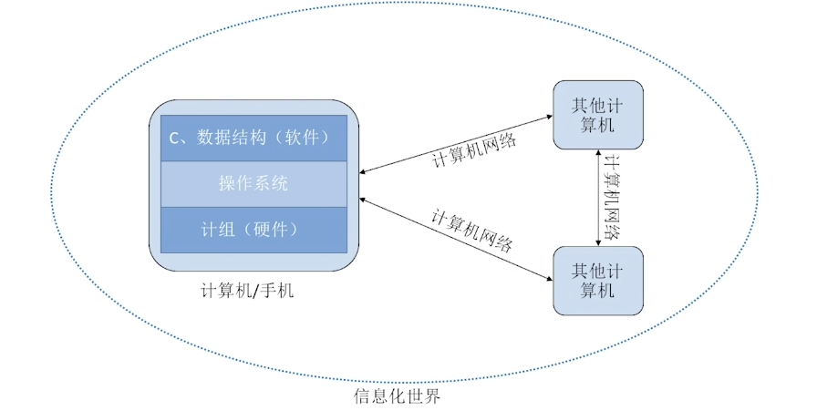
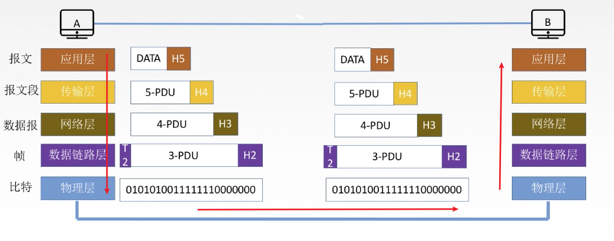
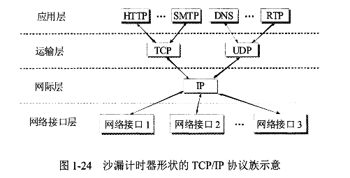
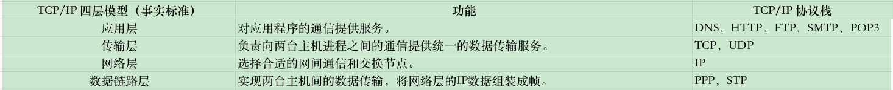
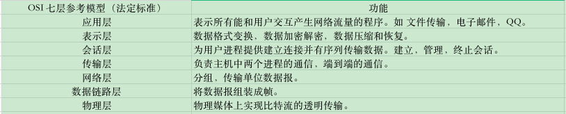

# 计算机网络体系结构

## 计算机网络

在宏观的视角下，计算机网络是帮助计算机实现互通互联的功能。

在微观的视角下，计算机网络是使用分层的方式将信息封装处理进行发送，再用拆解方式进行读取信息，每层实现相应的功能，最终达到网络信息的相互传递。

学习计算机网络，就是学习计算机网络体系结构中每一层的功能(作用)和每层中使用的具体协议，掌握协议的具体信息含义和使用方式。层与层之间的通信就是协议与协议之间通信一样。下面是一个协议之间相互关系图。

计算机网络体系结构是一个分层结构，它由多个层和每层的网络协议栈组成。

分层的作用是将复杂问题简单化，每层只关注自己需要实现的功能即可。

目前体系结构的分层模型有两个：TCP/IP分层模型，OSI七层参考模型。

## TCP/IP分层模型

现在的实际运用的还是TCP/IP分层模型这个标准。

## OSI七层参考模型

OSI七层参考模型是在国际标准组织（ISO）定义的，但是由于这个模型出来比较晚，并且当时TCP/IP的互联网在全球相当大的范围运行了，所以最终没有厂家生产符合OSI标准的商用产品，因此现在TCP/IP就常被称为是事实上的国际标准。
