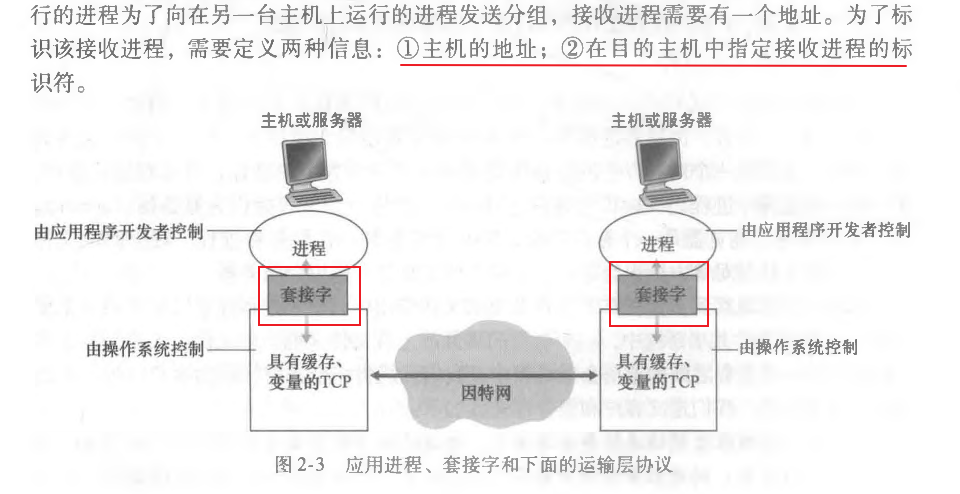

# 应用层介绍

应用层是 TCP/IP 体系结构的最顶层。

应用层的内容是定义和规范运行在操作系统中的应用程序的相关协议标准。

应用程序：是软件的统称，具体软件有 QQ，微信，英雄联盟，这些都是应用程序。这些应用程序需要与其他主机上的程序相互通信，需要在系统上运行起来，这就成了操作系统中的进程。

两个台主机进程实现通信，就是通过计算机网络交互报文（massage）进行实现的。

进程的报文通过套接字进行发送和接收，如下图：

 
套接字包含信息：主机地址，在目的主机中标识进程的标识符（端口号）

套接字：是应用程序进程和传输层协议之间的接口。

在应用层，应用程序通过把报文发送进套接字实现网络进程间的相互通信。

应用层协议要做的内容：

* 如何构造报文？
* 报文包含什么内容，字段什么含义？
* 进程何时发送报文？

应用层协议定义了：

* 交换报文的类型，如请求报文，响应报文。
* 报文语法，如报文中有哪些字段，这些字段如何描述。
* 字段含义是什么。
* 进程如何发报文，如何响应报文。

学习应用层，是通过了解应用层的相关应用程序和它使用应用层的具体协议的方式来学习，学习后要清楚协议的具体内容。

具体学习： DNS服务与DNS协议；WEB应用与HTTP协议。

