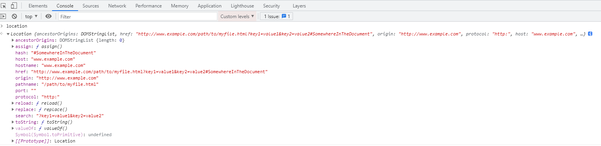

# HTTP URL （网址）

统一资源定位符（Uniform Resource Locator，URL），是URI最常见的表现形式，也称网址。

[URI](https://zh.wikipedia.org/wiki/%E7%BB%9F%E4%B8%80%E8%B5%84%E6%BA%90%E6%A0%87%E5%BF%97%E7%AC%A6) 是在电脑术语中是用于标志某一互联网资源名称的字符串。

## 编码方式
URL使用 ASCII 编码方式， 当 URL 中包含非 ASCII 码字符会转为 十六进制字节值，然后在前面加个百分号 %。如 ： 空格被转义成 %20

## URL 组成部分,6部分
> http://www.example.com:80/path/to/myfile.html?key1=v1&key2=v2#SomewhereInTheDocument

1. 协议 Protocol
> http:  ,  也可以是安全协议， https:

2. 主机 Domain Name
> www.example.com , 也可以是ip ， 123.1.2.3 

3. 端口号 Port
> 80,   http协议默认端口号是80，https的是443， 当使用默认端口号时可以不写

4. 路径 Path to the file
> /path/to/myfile.html  代表服务器资源的路径，现在可能是一个服务接口的路由

5. 查询参数 Parameter
> ?key1=v1&key2=v2  查询参数，以 ？开头，后面是键值对方式，多个键值对使用 & 符合分割

6. 资源锚点 Anchor
> #SomewhereInTheDocument  以#开头，代表资源的某部分锚点，标识资源的‘书签‘，也称为片段标识符。

在前端浏览器上可以通过 Window 对象中的 location 对象获取 URL 的所有信息，如下图：



```js
hash: "#SomewhereInTheDocument"
host: "www.example.com"
hostname: "www.example.com"
href: "http://www.example.com/path/to/myfile.html?key1=v1&key2=v2#SomewhereInTheDocument"
origin: "http://www.example.com"
pathname: "/path/to/myfile.html"
port: ""
protocol: "http:"
```

### 参考

<https://developer.mozilla.org/zh-CN/docs/Learn/Common_questions/What_is_a_URL>