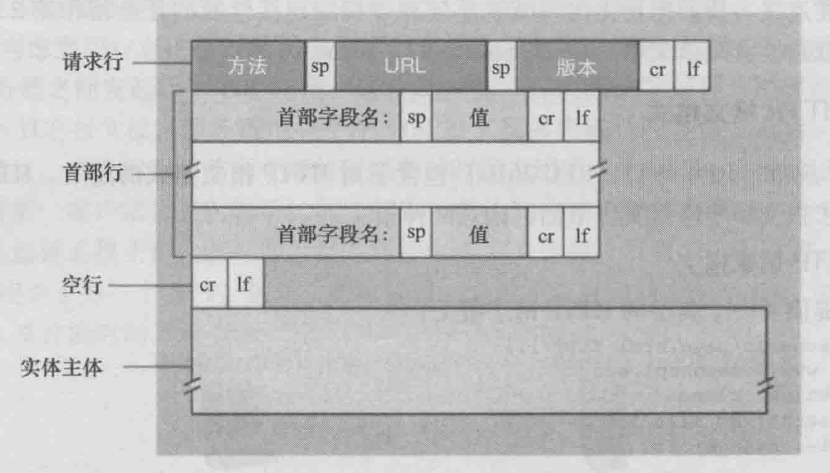
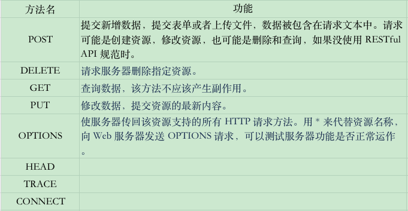

# HTTP 请求报文

HTTP 请求报文由客户端发起，可以是浏览器，postman 工具，curl 工具。

## 格式

请求报文由 4 部分组成
* 请求行
* 请求头 Request Headers
* 空行
* 请求体 （可选） Request Payload

具体如下图，请求报文的内容都是以键值对方式，每一对内容后面都会 回车换行



## 内容

### 请求行

请求行是请求报文的第一行，它由三部分组成
* 请求方法
* 请求地址 [URL](./02_url.md)  
* HTTP 协议/版本 （值为：HTTP/1.0  或者 HTTP/1.1）

#### 请求方法

HTTP /1.1 协议中定义了 8 种方法，用于操作资源。


 

##### GET 与 POST 方法对比

特性

* GET 请求是查询，获取数据，可以不用每次都查询数据库，可以使用缓存。例如二访问页面，页面的图片资源，css资源是可以使用缓存的。
* POST 是做新增，删除，更新操作，每次都操作数据库资源，不使用缓存。

对比
* 缓存角度：GET 请求会被浏览器主动缓存下来，留下历史记录，POST 默认不会。
* 编码方式角度：GET 请求的内容需要 URL 编码，只能接收 ASCII 编码，中文需要 URL 编码，POST 没有限制。
* 参数安全角度：GET 是放在 URL 中明文传输，不安全，POST 可以放在请求体中密文传输，适合传输敏感信息。
* 参数大小角度：首先明确 URL 本身对于数据大小没有限制。但是不同的浏览器，服务器会对 GET 请求传输的数据大小有限制，但对 POST 请求的数据大小无限制（一般受服务器处理程序能力影响）
* 幂等性角度：GET 是幂等的，POST 不是 （幂等是指相同的操作，结果也相同）

#### 请求 URL

具体可看 [URL](./02_url.md) 内容

#### 请求协议/版本

目前默认使用 HTTP/1.1 这个值。

### 请求头

请求头的格式：键： 值  ，注意冒号后面有一个空格。

如下具体例子

```js 
Accept: */*
Accept-Encoding: gzip, deflate, br
Accept-Language: zh-CN,zh;q=0.9,en;q=0.8
Connection: keep-alive
Content-Length: 21429
Content-Type: application/json
Host: api.github.com
Origin: https://github.com
Referer: https://github.com/
User-Agent: Mozilla/5.0 (Macintosh; Intel Mac OS X 10_13_5) AppleWebKit/537.36 (KHTML, like Gecko) Chrome/67.0.3396.99 Safari/537.36
``` 

常见的请求头 Request Headers


### 请求体

请求体是 POST 请求方法中的请求参数，以 key = value   形式进行组织和传递，多个请求参数使用 & 符号进行拼接。请求头中 Content-Length 记录请求体的长度。

请求体根据不同的场景会出现不同的形式

查询字符串：

任意请求体：from表单

文件上传：

