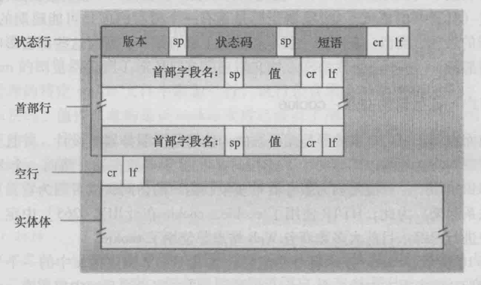

# HTTP 响应报文

响应报文由服务端返回。

## 格式

响应报文由 4 部分组成
* 响应行（状态行）
* 响应头
* 空行
* 响应体 Response

具体格式如下图：



## 内容

### 响应行（状态行）

响应行由 3 部分组成
> 协议/版本 状态码 状态短语
```js
HTTP/1.1 200 OK
```

响应行通过状态码，进行标识请求的响应状态结果，状态码由 3 位数字组成，可以分成 5 类。

|状态码 |  功能|
|----|--|
|1xx |表示目前是协议处理的中间状态，还需要后续操作，是临时响应。|
|2xx |成功处理了请求的状态。|
|3xx |要完成请求，需要进一步操作。通常，这些状态码用来重定向。|
|4xx |客户端错误，请求内容可能出错，妨碍了服务器的处理。|
|5xx |服务端错误，服务端出来请求时发生内部错误。|

#### 具体状态码列表


### 响应头

用于传递附加信息。

常见响应头信息

### 响应体

响应体一般是接口返回数据（JSON 数据），或者是文件内容（例如 html文档，css文档，JavaScript文档）。